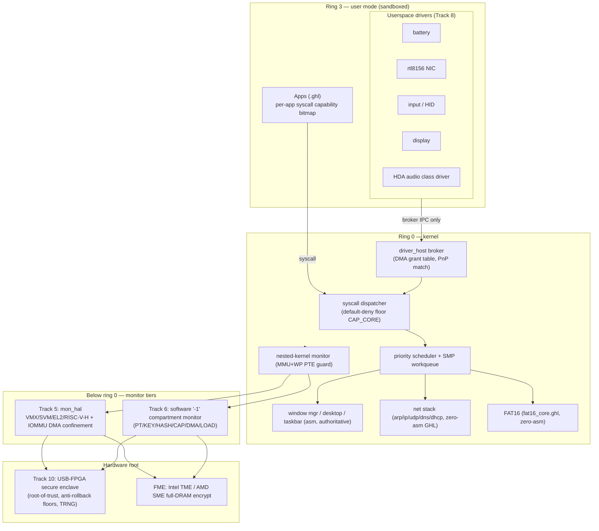
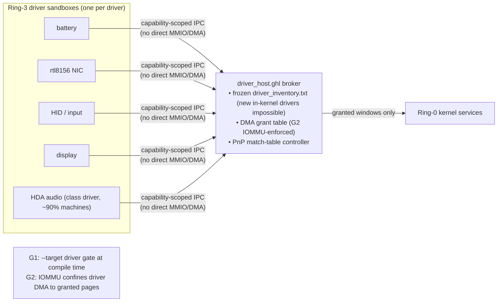
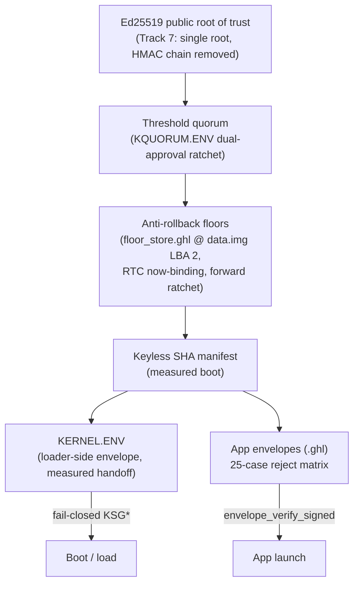
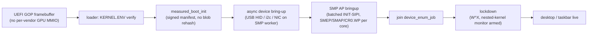
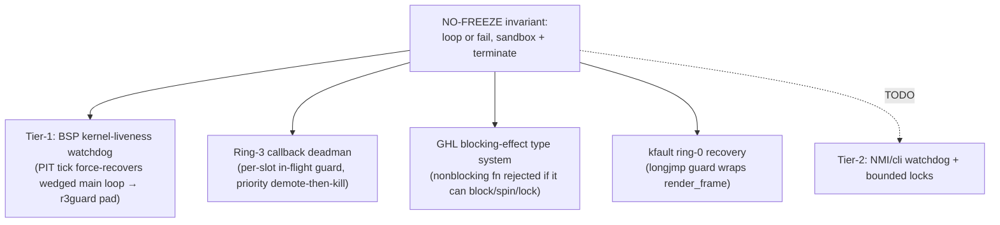

# Grit Architecture Charts

Quick reference diagrams: what runs where, what's sandboxed inside what, and
who talks to whom. Generated from the current design tracks.

---

## 1. Privilege rings — who sits where

---

## 2. Driver sandboxing (Track 8) — what's confined and how

---

## 3. Trust chain (Track 2 / Track 7) — single public root

---

## 4. Boot → lockdown sequence

---

## 5. Liveness / no-freeze protection

---

> Diagrams render in any Mermaid-aware viewer (GitHub, VS Code Mermaid preview).
> Source tracks: see `docs/architecture-defense-in-depth.md` and per-track TODO docs.
